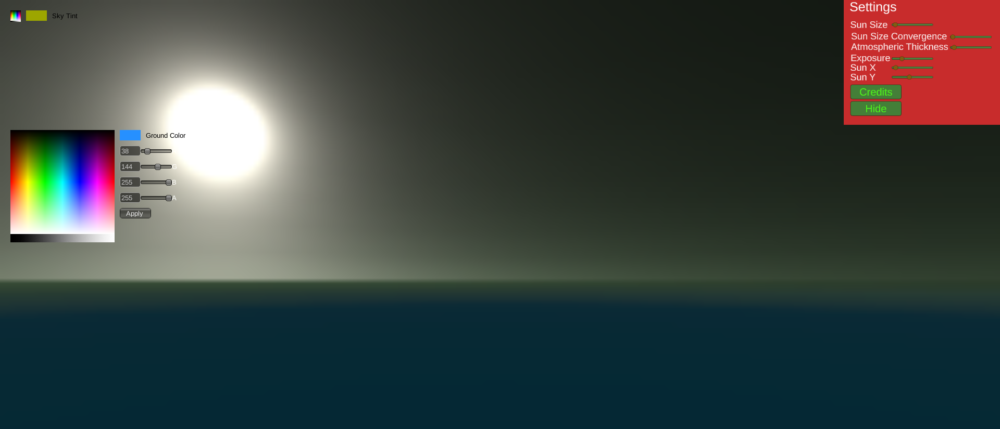

# `procedural-skybox`
 
The Procedural Skybox Designer built with Unity

## Viewing

To preview, go to <https://Yash-Singh1.github.io/procedural-skybox/bin/>

## Development

The `bin/` directory contains the WebGL compiled version of the game. The `src/` directory contains the real code usable in the Unity.

## Contributing

Contributions are welcome!
